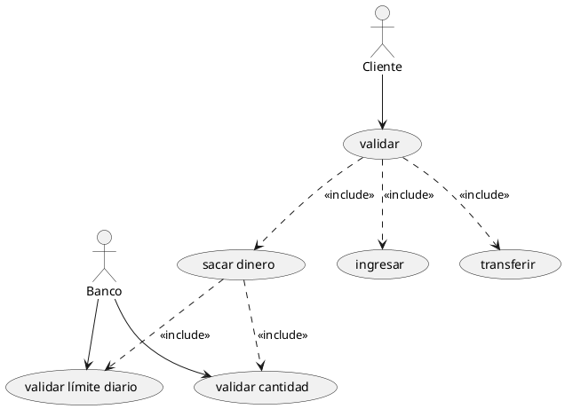

# Actividad-Casos-de-uso

## 1. Crea el diagrama de uso haciendo uso de platuml, representado los actores y casos de uso que identifiques en los requisitos.

Aqui tienes el codigo en plantuml:

## 2. Descripción del Caso de Uso: "Sacar Dinero"

### **ID:** UC2  
### **Actor Principal:** Cliente  
### **Actores Secundarios:** Banco  

### **Precondiciones:**
- El cliente debe estar autenticado.
- El cliente debe tener saldo suficiente en su cuenta.

### **Flujo Principal:**
1. El Cliente selecciona la opción de "Sacar Dinero".
2. El sistema solicita validación del usuario (*UC1: Validar*).
3. Una vez validado, el sistema solicita la cantidad a retirar.
4. Se verifica que la cantidad no supere el límite diario (*UC5: Validar límite diario*).
5. Se verifica que el saldo en la cuenta sea suficiente (*UC6: Validar cantidad*).
6. Si ambas validaciones son exitosas, el sistema procesa la solicitud y entrega el dinero.
7. Se registra la transacción en el sistema del banco.
8. Se muestra un mensaje de confirmación al Cliente.

### **Flujos Alternativos:**
- Si la validación del usuario falla, se muestra un mensaje de error y el proceso termina.
- Si el saldo es insuficiente, se muestra un mensaje informando al Cliente y el proceso termina.
- Si el retiro excede el límite diario, se informa al Cliente y el proceso termina.

### **Postcondiciones:**
- Se ha realizado el retiro de dinero exitosamente si todas las validaciones pasaron.
- Se ha actualizado el saldo del Cliente.

## 3. ¿Para qué sirve un Diagrama de Casos de Uso?

Un **diagrama de casos de uso** sirve para modelar y entender el comportamiento del sistema desde la perspectiva de los usuarios y sus interacciones con el sistema. Sus principales aportes son:

- **Claridad en los requisitos:** Permite visualizar de manera simple qué funciones o procesos tiene el sistema y quiénes las ejecutan.
- **Comunicación efectiva:** Ayuda a los desarrolladores, analistas y clientes a comprender mejor cómo operará el sistema sin necesidad de detalles técnicos.
- **Detección temprana de errores o mejoras:** Al representar las interacciones antes del desarrollo, se pueden identificar casos no considerados o situaciones especiales.
- **Base para documentación y pruebas:** Facilita la creación de pruebas de usuario y documentación del sistema.

