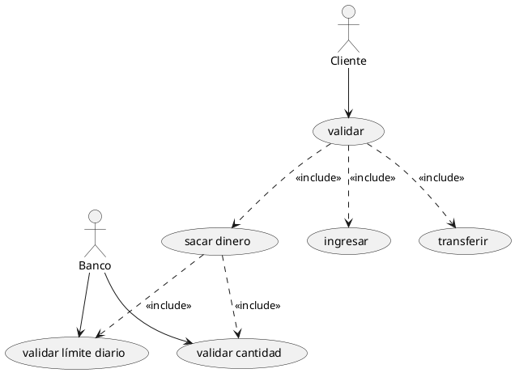

# Actividad-Casos-de-uso

## Crea el diagrama de uso haciendo uso de platuml, representado los actores y casos de uso que identifiques en los requisitos.

Aqui tienes el codigo en plantuml:

```plantuml
@startuml

actor Cliente

actor Banco

usecase "validar" as UC1

usecase "sacar dinero" as UC2

usecase "ingresar" as UC3

usecase "transferir" as UC4

usecase "validar límite diario" as UC5

usecase "validar cantidad" as UC6

Cliente --> UC1

UC1 ..> UC2 : <<include>>

UC1 ..> UC3 : <<include>>

UC1 ..> UC4 : <<include>>

Banco --> UC5

Banco --> UC6

UC2 ..> UC5 : <<include>>

UC2 ..> UC6 : <<include>>

@enduml
```

